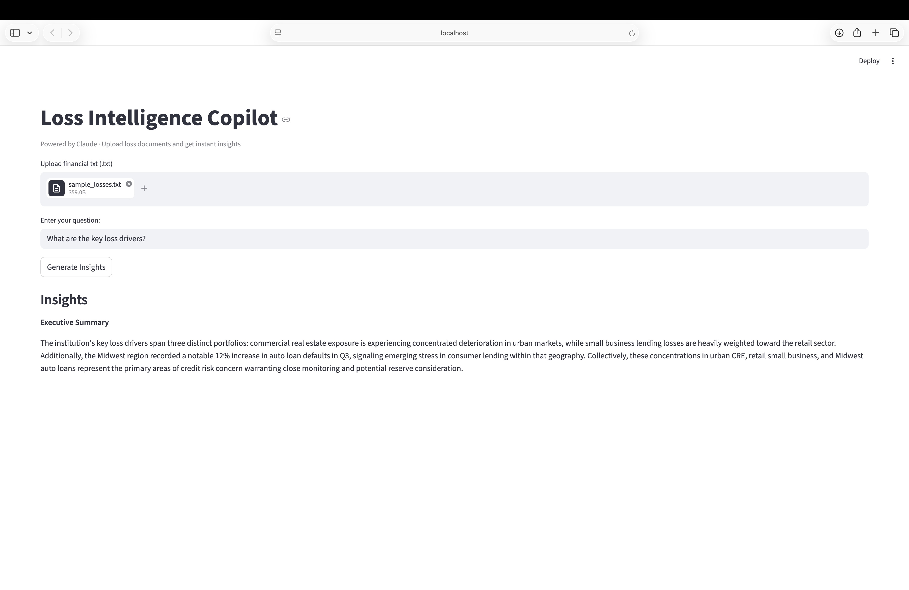

# Loss Intelligence Copilot

An AI-powered RAG (Retrieval-Augmented Generation) application that analyzes loss documents and generates executive-level credit risk insights using Claude.

## Demo


## What it does
Upload internal loss documents and ask natural language questions. The app retrieves the most relevant context using FAISS vector search and synthesizes a concise executive summary using Claude — without hallucinating facts not present in the data.

## Architecture
User uploads .txt document
↓
HuggingFace Embeddings (all-MiniLM-L6-v2)
↓
FAISS Vector Index
↓
Similarity Search (top-k chunks)
↓
Claude (claude-sonnet-4-6) synthesis
↓
Executive Summary in Streamlit UI

## Tech Stack
- **LLM:** Anthropic Claude (claude-sonnet-4-6)
- **Embeddings:** HuggingFace all-MiniLM-L6-v2 (local, no API key needed)
- **Vector Store:** FAISS
- **Framework:** LangChain
- **UI:** Streamlit
- **Language:** Python 3.11

## Project Structure
p2-loss-copilot/
├── app.py                  # Streamlit UI
├── rag/
│   ├── embedder.py         # Chunks and embeds documents into FAISS index
│   └── retriever.py        # Similarity search — returns top-k chunks
├── llm/
│   └── synthesizer.py      # Sends retrieved context to Claude
├── data/
│   └── sample_losses.txt   # Sample loss document for testing
├── requirements.txt
└── README.md

## Key Technical Decisions
- **RAG over fine-tuning** — model weights unchanged, context injected at query time. Faster, cheaper, and works with dynamic data
- **Local embeddings** — HuggingFace model runs locally, no additional API costs
- **Constrained system prompt** — Claude instructed to use only provided context, preventing hallucination. Responds with "insufficient context" when data is unavailable
- **temperature=0.1** — near-deterministic outputs for consistent analytical results

## How to Run

### 1. Clone the repo
```bash
git clone https://github.com/eswargutlapalli/ai-portfolio.git
cd ai-portfolio/p2-loss-copilot
```

### 2. Create virtual environment
```bash
python3.11 -m venv venv
source venv/bin/activate
```

### 3. Install dependencies
```bash
pip install -r requirements.txt
```

### 4. Set up API key
```bash
# create .env file
cp .env.example .env
# add your Anthropic API key to .env
ANTHROPIC_API_KEY=your-key-here
```

### 5. Run the app
```bash
streamlit run app.py
```

## Sample Output
**Query:** What are the key loss drivers?

**Response:**
> The institution's key loss drivers span three distinct portfolios: commercial real estate exposure is experiencing concentrated deterioration in urban markets, while small business lending losses are heavily weighted toward the retail sector. Additionally, the Midwest region recorded a notable 12% increase in auto loan defaults in Q3, signaling emerging stress in consumer lending within that geography. Collectively, these concentrations represent the primary areas of credit risk concern.

## What's Next
- P3: Autonomous Risk Analyst Agent (SQL + RAG + multi-step reasoning)

## Author
Eswar Gutlapalli — [GitHub](https://github.com/eswargutlapalli/ai-portfolio)